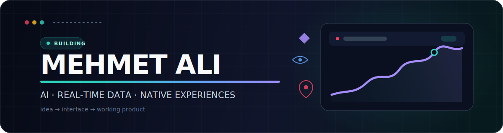

<p align="center">
  
</p>

<p align="center">
  <a href="https://mehmetali.cv"></a>
  <a href="https://github.com/Maero47?tab=followers"></a>
  
</p>

## Hello — I'm Mehmet Ali

I build product-focused software where **AI, real-time data, and thoughtful interfaces** meet. My projects range from a native macOS browser to market-intelligence tools and AI assistants.

I care about turning an ambitious idea into something people can actually open, understand, and use.

## Selected builds

<table>
  <tr>
    <td width="50%" valign="top">
      <h3>📈 <a href="https://github.com/Maero47/Stockmind">StockMind</a></h3>
      <p>AI-powered stock and crypto analysis with live market data, technical indicators, ML predictions, news sentiment, alerts, and multi-provider AI chat.</p>
      <p><code>Next.js</code> <code>FastAPI</code> <code>XGBoost</code> <code>WebSockets</code> <code>Supabase</code></p>
    </td>
    <td width="50%" valign="top">
      <h3>🍒 <a href="https://github.com/Maero47/Cherry-Internet-Browser">Cherry Browser</a></h3>
      <p>A native macOS browser built with SwiftUI and WebKit, featuring tab groups, vertical tabs, tab sleeping, bookmarks, history, and multi-window workflows.</p>
      <p><code>Swift</code> <code>SwiftUI</code> <code>WebKit</code> <code>AppKit</code></p>
    </td>
  </tr>
  <tr>
    <td width="50%" valign="top">
      <h3>🎙️ <a href="https://github.com/Maero47/AI-recepcionist">AI Receptionist</a></h3>
      <p>An AI reception and lead-capture platform with business knowledge, FAQ and service management, chat, voice webhooks, notifications, and an operations dashboard.</p>
      <p><code>Next.js</code> <code>TypeScript</code> <code>Supabase</code> <code>AI</code></p>
    </td>
    <td width="50%" valign="top">
      <h3>🍳 <a href="https://github.com/Maero47/Chaos-Kitchen">Chaos Kitchen</a></h3>
      <p>A playful AI cooking experience with ingredient swaps, guided recipes, generated narration, and speech — built to make the kitchen feel less predictable.</p>
      <p><code>Next.js</code> <code>Groq</code> <code>Tailwind CSS</code> <code>Text to Speech</code></p>
    </td>
  </tr>
</table>

## Toolbox

<p>
  
</p>

```text
PRODUCT        AI / DATA          PLATFORM
UX-minded      LLM integration    Next.js + React
Fast iteration ML predictions     FastAPI + Supabase
Native macOS   Real-time streams  SwiftUI + WebKit
```

## GitHub snapshot

<p align="center">
  
  
</p>

## Contribution trail

<picture>
  <source media="(prefers-color-scheme: dark)" srcset="https://raw.githubusercontent.com/Maero47/maero47/output/github-contribution-grid-snake-dark.svg" />
  <source media="(prefers-color-scheme: light)" srcset="https://raw.githubusercontent.com/Maero47/maero47/output/github-contribution-grid-snake.svg" />
  
</picture>

## Let's make something useful

I'm interested in AI-native products, macOS software, financial technology, and ideas that deserve a polished prototype.

<a href="https://mehmetali.cv"><strong>Explore my work →</strong></a>
