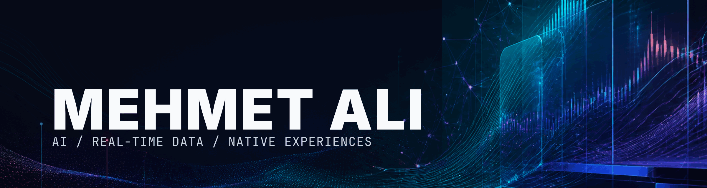

  

  
  

Computer Science student at the University of Birmingham. I work on the seam where a
language model meets live data and an interface someone actually has to use — the part
that demos easily and is hard to make trustworthy.

Four projects below, all of them mine end to end: a market-analysis platform, a macOS
browser that Claude Code can drive, a flight search you can run before you have a single
API key, and a set of Haskell notes written in Turkish for people taking the module in
English. I would rather finish one thing you can open than start five you can only read
about.

## Projects

### [StockMind](https://github.com/Maero47/Stockmind)

Stock and crypto analysis that runs on your own API key: the AI chat streams its
analysis through whichever of Groq, OpenAI, Anthropic or Gemini you bring, and the key
is encrypted before it is stored. Underneath it are Binance and Finnhub WebSockets for
sub-second crypto and live stock trade ticks, the indicator set you would expect — RSI,
MACD, Bollinger, EMA, ATR, support and resistance — and an XGBoost model trained on two
years of daily data that calls next-day direction with a confidence score. Headlines come
scored for sentiment, the watchlist and price alerts sync to your account through
Supabase, and the whole thing installs as a PWA.

`Next.js` · `FastAPI` · `XGBoost` · `WebSockets` · `Supabase`

### [Cherry Browser](https://github.com/Maero47/Cherry-Internet-Browser)

A Mac browser with an MCP server inside it: switch it on and Cherry serves nine tools on
`127.0.0.1` behind a bearer token, so Claude Code or Codex can list your tabs, read the
page you are looking at, search your history or open one — and only click and type after
you allow it in a dialog. The AI side panel reads the current page and researches across
several open tabs with citations, running on Apple's on-device model or a local Qwen you
download yourself; nothing about your page leaves the Mac. It renders with `WKWebView`,
the engine Safari uses, so Cherry is the browser around the engine rather than a new one
— signed and notarized, outside the App Store, macOS 26.2 or later. There is also a cat
called Pearl, who lives on your pages and doubles as the offline-page game.

`Swift` · `SwiftUI` · `WebKit` · `AppKit` · `MCP`

### [Rotam](https://github.com/Maero47/Rotam)

A flight search you can clone and run before you have a single API key. Two live sources
sit behind one facade — Sky-Scrapper for search, autocomplete, results and detail,
Travelpayouts for the price calendar and popular destinations — and every `/api` route
falls back to a built-in dataset when the key is missing, the quota is spent or the
upstream is slow, then tags the response `live` or `mock` so the page can admit which one
you are looking at. Either way you get the whole product: a two-month calendar with the
cheapest fare on each day, best/cheapest/fastest sorting with stop and price filters that
write themselves into the URL, a detail page comparing the sellers of one flight, and
starred flights, watched routes and recent searches in `localStorage` — no account, no
database. Colour, spacing and radius all come from one block of Tailwind tokens; the
palette is anthracite and red in the register of a Turkish carrier, and every airline in
it is invented.

`Next.js` · `React` · `TypeScript` · `Tailwind CSS` · `RapidAPI`

### [Haskell FP Notes (Turkish)](https://github.com/Maero47/haskell-fp-turkce-notlar)

The one thing here that teaches rather than ships. I took functional programming in
English and wrote the module back out in Turkish while I was sitting it: eleven topics
running from types and polymorphism through recursion, higher-order functions, list
comprehensions, type classes, algebraic data types, trees and proof by induction, and
finishing on monads. Each topic is a written explanation, nearly all of them with a
companion `.hs` file you can load straight into GHCi and exercises in three tiers — basic,
intermediate, advanced — so you can stop where your confidence does. The last folder is
exam preparation: worked solutions to a mock paper, and the five mistakes I kept making
set out as the wrong version beside the right one. It is notes, not a library — the point
was that nobody should have to meet `foldr` and inductive proof in a second language at
the same time.

`Haskell` · `GHCi` · `Markdown`

## Tools

  

## Contributions

<picture>
  <source media="(prefers-color-scheme: dark)" srcset="https://raw.githubusercontent.com/Maero47/maero47/output/github-contribution-grid-snake-dark.svg" />
  <source media="(prefers-color-scheme: light)" srcset="https://raw.githubusercontent.com/Maero47/maero47/output/github-contribution-grid-snake.svg" />
  
</picture>

---

Interested in AI-native products, macOS software and fintech. Case studies and
contact details live at **[mehmetali.cv](https://mehmetali.cv)**.
