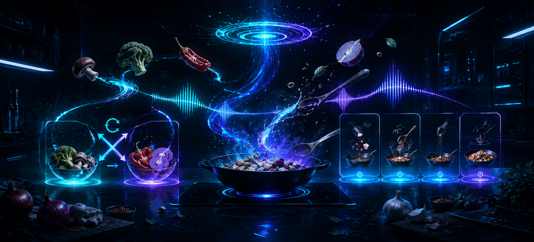

  

  
  

Third-year Computer Science student at the University of Birmingham. I work on the
seam where a language model meets live data and an interface someone actually has to
use — the part that demos easily and is hard to make trustworthy.

Four projects below, all of them things I built end to end: a market-analysis
platform, a native macOS browser, an AI reception desk, and a cooking app that
refuses to take itself seriously. I would rather finish one thing you can open than
start five you can only read about.

## Projects

### [StockMind](https://github.com/Maero47/Stockmind)

Stock and crypto analysis in one place: live market data over WebSockets, technical
indicators, XGBoost price predictions, news sentiment, and price alerts — plus a chat
layer that can talk to several AI providers. A Next.js front end on a FastAPI service.

`Next.js` · `FastAPI` · `XGBoost` · `WebSockets` · `Supabase`

### [Cherry Browser](https://github.com/Maero47/Cherry-Internet-Browser)

A macOS browser with an on-device model that reads the page you are on, so nothing
leaves the machine to answer a question about it. Tab groups, vertical tabs, tab
sleeping, bookmarks, history and multi-window, built native rather than wrapped.

`Swift` · `SwiftUI` · `WebKit` · `AppKit`

### [AI Receptionist](https://github.com/Maero47/AI-recepcionist)

An AI front desk for small businesses: it answers from a knowledge base you control,
handles FAQs and services, takes chat and voice through webhooks, sends notifications,
and hands the owner a dashboard for everything it captured.

`Next.js` · `TypeScript` · `Supabase`

### [Chaos Kitchen](https://github.com/Maero47/Chaos-Kitchen)

Cooking with the recipe fighting back. It swaps your ingredients, walks you through
what to do about it, and narrates the whole thing out loud with generated speech.

`Next.js` · `Groq` · `Tailwind CSS` · `Text to Speech`

## Tools

  

## Contributions

<picture>
  <source media="(prefers-color-scheme: dark)" srcset="https://raw.githubusercontent.com/Maero47/maero47/output/github-contribution-grid-snake-dark.svg" />
  <source media="(prefers-color-scheme: light)" srcset="https://raw.githubusercontent.com/Maero47/maero47/output/github-contribution-grid-snake.svg" />
  
</picture>

---

Interested in AI-native products, macOS software and fintech. Case studies and
contact details live at **[mehmetali.cv](https://mehmetali.cv)**.
